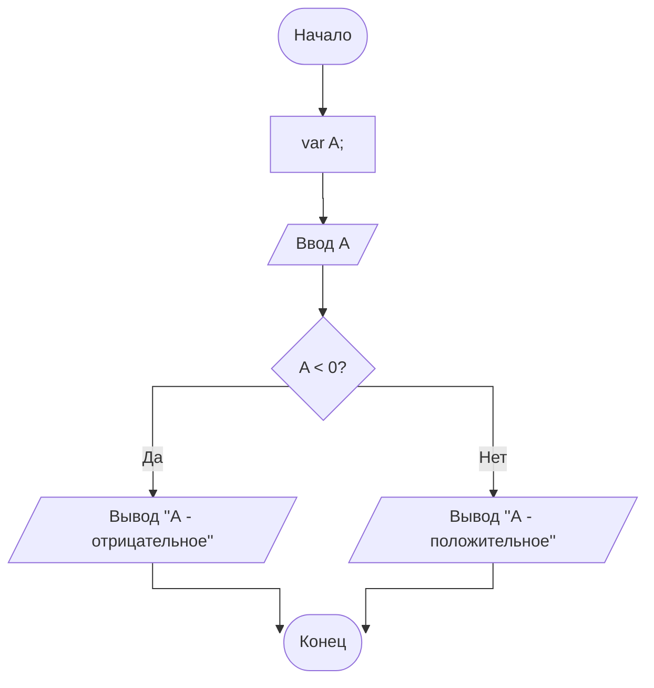
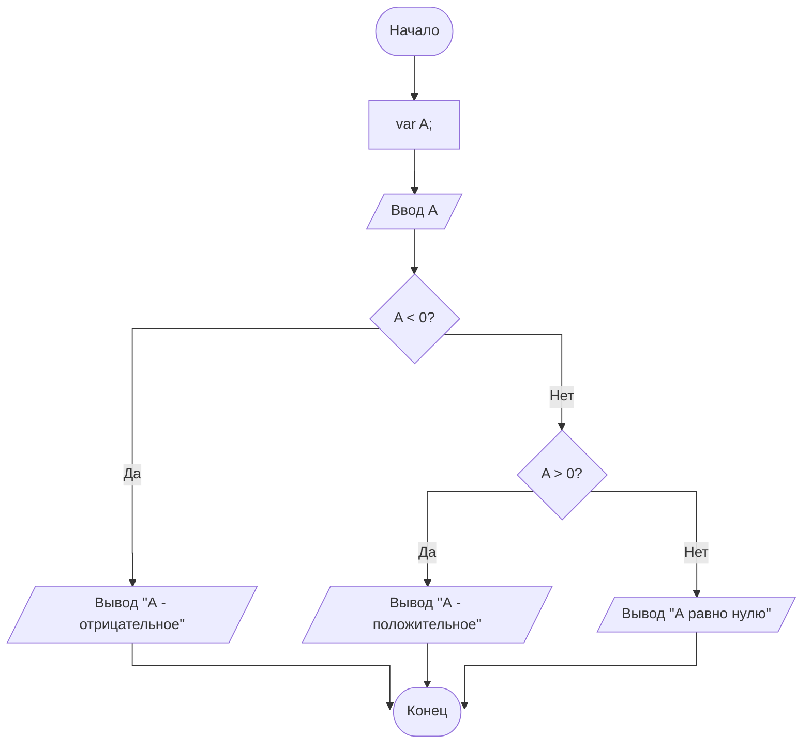

# Алгоритмические конструкции
Итак, в прошлой теме мы рассмотрели каким образом можно составлять алгоритмы для наших программ: *словесно*, *алгоритмическим языком* и *блок-схемами*. А какие алгоритмы бывают в принципе? Для того чтобы учитывать все случаи в алгоритмах у нас предусматривается три базовые конструкции: **следования**, **ветвления** и **повторения**.

## Линейные алгоритмы (следования)
Буквально означают и описываются таким образом, что все этапы работы программы выполняются строго последовательно и друг за другом. Пример словесного описания такого алгоритма приводился в прошлой статье задачкой про Васю и Мишу.

```
S1: Начало программы; 
S2: Создаём переменную vasya; 
S3: Создаём переменную misha; 
S4: Присваиваем переменной vasya значение 5; 
S5: Присваиваем переменной misha значение 6; 
S6: Создаём переменную sum; 
S7: Записываем в переменную sum сумму значений из vasya и misha 
S8: Выводим значение sum; 
S9: Завершение программы.
```

В формате блок-схемы данный алгоритм будет выглядеть следующим образом:

```mermaid
graph TB
    AG("&nbsp;Начало&nbsp;")
    style AG rx:25,ry:50 
    AG --> B["var vasya, misha;"]
    B --> C["vasya = 5;<br>misha = 6;"]
    C --> D["var sum = vasya + misha;"]
    D --> E[/Вывод sum/]
    E --> ND
    ND("&nbsp;&nbsp;Конец&nbsp;&nbsp;")
    style ND rx:25,ry:50
 ```
 !!!
 Обратите внимание, что для создания новых переменных мы используем сокращение **var** (от англ. *variable*). Если вы работаете со строго типизированными языками программирования вместо var желательно указывать тип переменной (int, float и т.д.).
 !!!

Рассмотрим каждый блок поочерёдно:
1. Начинаем работу программы
2. Создаём переменные vasya и misha
3. Задаём значения переменным vasya и misha
4. Создаём переменную sum и задаём ей значение суммы vasya и misha
5. Выводим значение sum в консоль
6. Заканчиваем работу программы

И разберём блоки, которые тут присутствуют и что они делают.

 - Прямоугольник - **действие** (*или операция*). Этот блок мы используем в тех случаях, когда вводим в систему новые переменные или осуществляем базовые операции: изменение значения, математические операции и т.д.
 - Параллелограмм - **данные** (*или ввод-вывод*). С помощью этого блока мы выводим значения переменных или произвольный текст в консоль, а также считываем значения вводом с клавиатуры; так пользователь может указывать значения переменных по ходу работы программы.
 - Почти овал (закругленный прямоугольник) - **ограничитель**. Этот блок указывает, где у нас начинается программа и где она заканчивается.
 
 
 ## Условные алгоритмы (ветвления)
 
Пускай линейные алгоритмы и являются самыми распространёнными и необходимыми, но они довольно ограничены в своих возможностях. Когда мы рассматриваем однозначные, базисные задачки, они превосходно справляются со своей целью. Но что если мы возьмём задачу поинтереснее?

> Пользователь вводит с клавиатуры число А. Напишите программу которая определяет, было введено положительное или отрицательное число.

В случае с такой задачкой нам необходимо каким-то образом проверить введённое число и вывести сообщение о том, положительное оно или отрицательное. И тут нам на помощь приходят алгоритмы ветвления!

С помощью данных алгоритмов мы можем проверять переменные на то, чтобы они удовлетворяли определённому условию. Если **условие выполняется**, то у нас происходят одни операции, а если **нет** - то другие. Описывается это всё дело следующим образом:
```
S1. Начало работы программы;
S2. Создаём переменную А;
S3. Вводим значение переменной А с клавиатуры;
S4. Если переменная А < 0, то переходим к S5, иначе S6;
S5. Выводим сообщение "А - отрицательное" и идём к S7;
S6. Выводим сообщение "А - положительное" и идём к S7;
S7. Завершение работы программы.
```
На блок-схеме такие алгоритмы понять можно проще:



Но вот ведь незадача: если мы введём ноль, то программа нам ничего не выдаст. Чтобы решить такую проблему мы можем вложить одно условие в другое.


В первом условии мы также рассматриваем, *меньше нуля ли у нас А*. Если нет, то у нас остаётся два варианта: либо **А > 0**, либо **A равно нулю**. Поэтому мы на ветке "**нет**" создаём ещё одно условие, где и проверяем, больше нуля ли у нас А.

Если **да**, то выводим соответствующее сообщение.  
Если **нет**, то последним случаем, который мы не рассмотрели остаётся **А = 0** и мы также выводим сообщение.

## Циклические алгоритмы (повторения)
Несмотря на всю силу линейных и условных конструкций, у них есть один нюанс: действия, которые в них происходят однократны и иногда из-за этого решить ряд задач просто невозможно. К примеру, задачи на расчёт факториала и последовательности Фибоначчи. Конечно мы можем расписать их вручную, но что если речь заходит об **очень больших** последовательностях? Рассмотрим одну задачу:
> Пользователь вводит с клавиатуры число. Рассчитать факториал этого числа.

Для простоты рассмотрения возьмём число **5**.

Факториал пяти это 1 * 2 * 3 * 4 * 5, т. е. помимо вводимого нами числа мы должны брать в рассмотрение все предыдущие числа. И тут на помощь приходят **циклы**!

Циклы сами по себе упрощают задачу обращения к однотипным элементам, а также сокращают количество используемого в программе кода. А некоторые фишки возможно реализовать только с помощью циклов.

Во всех блок-схемах у нас будет абсолютно одинаковое начало.  
Мы создаём переменные:
 - **N** (число, факториал которого считаем);  
 - **fact** (куда будем сохранять сам факториал числа, сразу *приравниваем к **1*** для перемножения);  
 - **i** (переменная-счётчик, объяснение будет далее).

Циклы можно описывать тремя разными способами; можете выбрать тот, который вам будет понятнее всего.

### **Способ 1**: Через блок цикла (шестиугольник)


### **Способ 2**: Через ограничители циклов (loop limits)


### Способ 3: Через условие и возврат в него


### Пояснительная часть циклов
В каждом случае в циклах мы используем специальную переменную-счётчик **i** (она может называться как угодно), по которой мы определяем, будет продолжать свою работу цикл или нет. Давайте попробуем представить работу нашего алгоритма максимально подробно.
 - Вводим в систему переменные **N**, **fact** = 1 и **i**;
 - Вводим значение **N** с клавиатуры (*к примеру вводим 3*);
 - **Начинаем цикл**<br>Стартовое значение **i: 1**<br>Конечное значение **i: N** (*введенное с клавиатуры значение, подставится 3*)<br>Размер шага **i: 1** (*после выполнения всех действий в цикле переменная увеличивается на 1*)
 - 1. Проверка условия от **i до N (i <= N)** >> 1 <= 3?<br>Да, значит fact = fact * i (1 * 1) = **1**;<br>Увеличиваем i на 1 (делаем i = 2).
 - 2. Проверка условия от **i до N (i <= N)** >> 2 <= 3?<br>Да, значит fact = fact * i (1 * 2) = **2**;<br>Увеличиваем i на 1 (делаем i = 3).
 - 3. Проверка условия от **i до N (i <= N)** >> 3 <= 3?<br>Да, значит fact = fact * i (2 * 3) = **6**;<br>Увеличиваем i на 1 (делаем i = 4).
 - 4. Проверка условия от **i до N (i <= N)** >> 4 <= 3?<br>Нет, значит прерываем работу цикла.
 - **Завершение цикла**
 - Выводим получившееся значение переменной fact (**6**).

При входе в цикл у нас сравнивается переменная-счётчик с каким-то заданным значением (это может быть переменная, константа или число). Если условие выполняется, то начнёт работу код написанный в цикле, а по окончанию изменится значение счётчика на заданный шаг и запустится следующая проверка условия. Код в цикле будет повторяться до тех пор, пока выполняется условие его работы.

## В дополнение

Также важно понимать, что разные конструкции вполне себе сочетаемы и могут вкладываться друг в друга (к примеру, в циклы можно помещать условия и наоборот). Также циклы могут работать не только от 1 до 5, но и от 5 до 1 (в обратном направлении), а размер шага не всегда должен быть единицей (так можно проскакивать четные/нечетные элементы или работать с дробными числами). Применение таким фишкам будет показано в дальнейших материалах.
