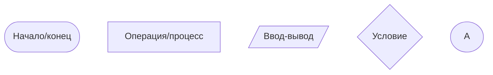

# Алгоритмы и их описание

Как уже рассматривалось в прошлой теме, алгоритмы есть и в повседневной жизни, но мы не обращаем особого внимания на них, задаваясь вопросами "_так, сейчас мне надо встать, затем дойти до ванной, потом взять в руки зубную щётку и пасту, потом..._". Это всё происходит само собой.  

Однако когда мы рассказываем кому-то о том, как прошёл наш день (например), этот алгоритм становится максимально ясным и понятным. Мы буквально описываем от начальной точки (начала дня) до конечной точки (текущего момента) то, что с нами происходило за сегодня. Чаще всего это описание выглядит как-то так:

> Ну я проснулся, умылся, поел, сходил на занятия.

И это практически один из видов реально существующего описания алгоритмов в программировании!

## Словесное описание алгоритма
Словесные описания буквально строятся из _тех же слов и категорий, которые мы используем в повседневной жизни_. Сами по себе задачи по программированию легче всего представлять именно в таком формате, а матёрые разработчики делают это в голове на автоматизме. Давайте рассмотрим для примера одну лёгкую задачу:

> У Васи есть 5 яблок, а у Миши - 6 яблок. Сколько всего яблок у ребят?

Вы уже наверняка поняли, что правильный ответ **11**. Но вы даже не задумывались о том, что ваш мозг автоматически обработал эту информацию и выдал вам ответ. А теперь разберёмся, как такую задачу прочитать и представить алгоритм её решения в форме словесного описания.

Для начала определимся, сколько у нас действующих лиц - их **два**: Вася и Петя.  
У каждого из действующих лиц есть яблоки и их количество **различно**.  
Из-за того, что объекты сами по себе одинаковые в рамках решения задачи их видом можно пренебречь, т.е. для рассмотрения мы возьмём **только** ***количество яблок***.  
А для того, чтобы узнать, сколько всего этих самых яблок, нам нужно **сложить их количество**.

Конечно такое подробное описание может показаться глупостью для студентов СПО и выше, но поверьте, с усложнением задач будет усложняться и их логика, а описание алгоритма подобным образом будет полезно всегда.

Такие алгоритмы также можно представить и на бумаге для простоты переноса в программный вид. Например:

    // Алгоритм в полной форме
    S1: Начало программы;
    S2: Создаём переменную vasya;
    S3: Создаём переменную misha;
    S4: Присваиваем переменной vasya значение 5;
    S5: Присваиваем переменной misha значение 6;
    S6: Создаём переменную sum;
    S7: Записываем в переменную sum сумму значений из vasya и misha
    S8: Выводим значение sum;
    S9: Завершение программы.
Объясню парочку моментов:  
***S1, S2, S3, ...*** - это отдельные операции, по которым должен выполняться наш алгоритм. Помните про требование _последовательности_ ко всем алгоритмам?  
***Переменная*** - это выделенное **пространство,** которое имеет **имя** (*по которому мы можем обращаться к переменной)* и может хранить **данные** (*в нашем случае мы храним количество яблок у каждого паренька*). Подробнее о переменных поговорим уже на стадии написании кода.

В остальном же мы просто описываем каждый шаг, необходимый для выполнения алгоритма. Выглядит конечно перегружено, но напомню, что большая часть программистов строит такие последовательности на автоматизме. Новичкам же будет полезно такое отработать для развития логики.

    // Алгоритм в сокращённой форме
    S1: Начало программы;
    S2: Создаём переменную vasya и присваиваем ей значение 5;
    S3: Создаём переменную misha и присваиваем ей значение 6;
    S4: Выводим значение vasya+misha;
    S5: Завершение программы.
Тут я довольно сильно сократил количество шагов, задавая значение переменной при её создании, а также выводя сумму сразу, не используя дополнительную переменную. Подробнее об этом будет показываться и рассказываться также на примерах с кодом.


## Алгоритмический язык

Построение алгоритмов на алгоритмическом языке приближено непосредственно к написанию кода, но не привязано к архитектуре компьютера, его устройству и языку программирования. При знании базиса этого языка можно описывать то, как должна работать программа, и это описание можно легко перенести на любой другой, реально существующий язык программирования и выполнить программу.  

Рассмотрим всё ту же задачу про Васю и Мишу и представим её на алгоритмическом языке:

```Стандартное описание на русском алгоритмическом языке
алг сколько всего яблок
цел vasya, misha, sum
нач ввод vasya, misha
    sum := vasya+misha
    вывод sum
кон
```

Алгоритмический язык появился очень давно (1958 год) и изначально был полноценным языком программирования (ALGOL), одним из первых высокого уровня.

Хотя язык сам по себе оказал заметное влияние на все разработанные позднее императивные языки программирования — в частности, на язык Pascal и C++, после появления новых языков Алгол начал терять свою актуальность, а сейчас не используется вовсе - ни для разработки, ни для реального описания алгоритмов. ¯\\_\_(ツ)_\_/¯

## Схематическое описание (блок-схемы)
*И тут пришло самое страшное...*

Блок-схемы вызывают у многих студентов неприязнь и недопонимание, но я думаю что это связано с тем, что изначально не объясняется, зачем оно нужно и как с этим правильно работать. **Я постараюсь это исправить!**

Сами по себе блок-схемы являются достаточно простым способом описать вашу систему *графически* в виде базовых блоков, исходя из которых строится вся программа. Во многом блок-схемы похожи на словесное описание, только вместо жёсткого указания текстом алгоритм работы программы, мы будем это делать с помощью фигурных элементов. Каждый из них осуществляет строго определённую роль, дабы не допускать путаницы при чтении схемы.

Разберём базовые блоки:


*Здесь указаны основные блоки, которые нам в дальнейшем пригодятся.*

Блок с буквой А называется **соединителем** и он используется в тех случаях, когда нам не хватает места чтобы полностью разместить блок-схему и нам требуется её перенос.

Пока что стоит просто запомнить их в лицо, ещё несколько блоков и то, как они связываются и выглядят на практике, разберём в следующей теме.

Но несмотря на свою понятность и функциональность, у блок-схем есть один значительный недостаток: они не могут отражать алгоритмы, которые реализуются во взаимодействии абстракций при объектно-ориентированном подходе (*т.е. с помощью них строятся только достаточно простые описания*).
Для описания более сложных и масштабируемых систем с большей гибкостью используются нотации **UML**, которые в частном случае рассматриваются в дисциплине "Проектирование и дизайн информационных систем", поэтому их мы покрывать не будем.
